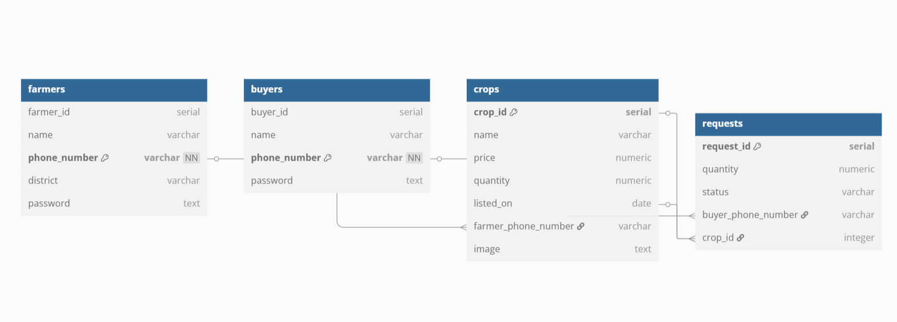

# 🌾 Cultivating Connections

**Cultivating Connections** is a web application revolutionizing the agricultural marketplace by connecting farmers directly with buyers — eliminating middlemen, promoting transparent pricing, and empowering local producers.

The platform enables farmers to list their crops and manage availability, while buyers can browse, filter, and request produce in desired quantities. Once a request is accepted, buyers get access to the farmer's contact details — ensuring seamless, transparent communication. Crop quantities are updated automatically, maintaining real-time inventory accuracy.

> Bridging the gap from **farm to table**, Cultivating Connections promotes a collaborative, local-first approach to agricultural commerce.

## 📚 Table of Contents

- 🎬 [Demo Video](#demo-video)
- ✨ [Features](#features)
- 🧰 [Tech Stack](#tech-stack)
- 🗃️ [Database Overview](#database-overview)
- 🚧 [Project Roadmap](#project-roadmap)
- 🙋‍♀️ [Author](#author)

## 🎬 Demo Video

Click below to watch the full demo:  

## ✨ Features

- 🔐 **User Authentication** – Secure sign-up and login for both farmers and buyers.
- 🌾 **Crop Listing & Management** – Farmers can add, edit, and delete crop listings with quantity and price.
- 🔍 **Search & Filter** – Buyers can browse crops based on type, region, or availability.
- 📥 **Request Management** – Buyers can send purchase requests; farmers can accept or decline.
- 📉 **Quantity Tracking** – Auto-adjust crop availability with each accepted request.
- 📞 **Direct Connect** – On acceptance, buyer gets access to farmer's contact details for communication.

## 🧰 Tech Stack

- 🖼 **Frontend**: EJS, Bootstrap 5
- ⚙️ **Backend**: Node.js, Express.js
- **Database**: PostgreSQL 
- **Authentication**: Passport *(bcrypt for encryption)*
- **Deployment**: *(to be deployed)*

## 🗃️ Database Overview

Here’s a high-level view of the database schema used in Cultivating Connections:

The main tables are:

- `farmers`: Stores registered farmers' contact details and credentials.
- `buyers`: Stores buyer accounts and authentication info.
- `crops`: Contains crop listings with price, quantity, and farmer association.
- `requests`: Tracks buyer requests for specific crops and their statuses.

> 📌 ER diagram created using [dbdiagram.io](https://dbdiagram.io)  

## 🚧 Project Roadmap

### ✅ Completed
- [x] User Authentication (Farmer & Buyer)
- [x] Crop Listing and Management by Farmers
- [x] Search and Filtering for Buyers
- [x] Request Management and Status Updates
- [x] Quantity Management (auto-updates on request acceptance)

## 🙋‍♀️ Author

**Kavya D**  
GitHub: [@kavya410004](https://github.com/kavya410004)  
LinkedIn: [Venkata Kavya Sai D](https://www.linkedin.com/in/venkata-kavya-sai-d-bb7717250/)  
Email: d.v.kavyasai.2004@gmail.com  

